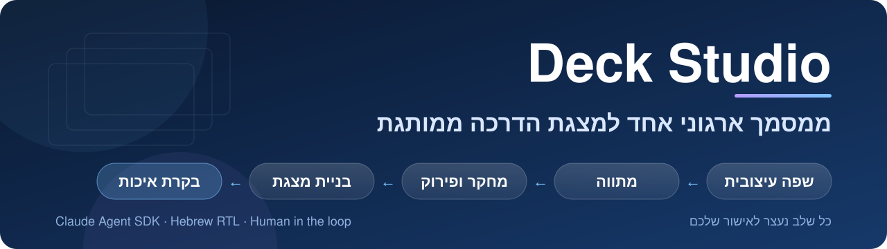
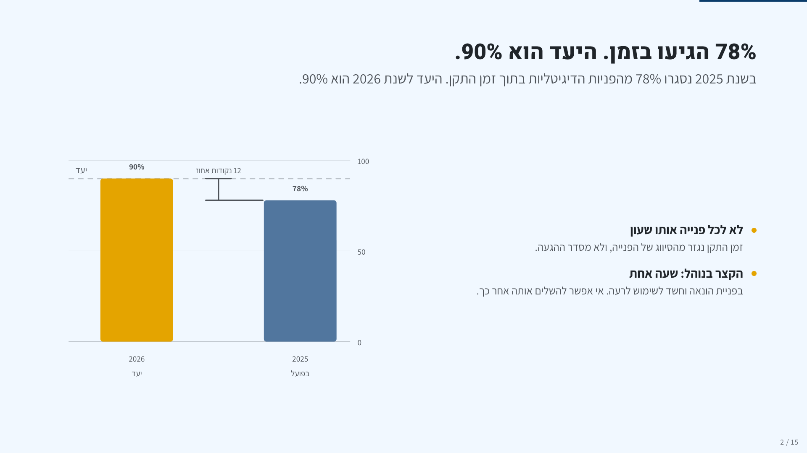
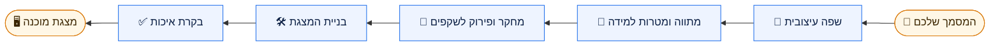
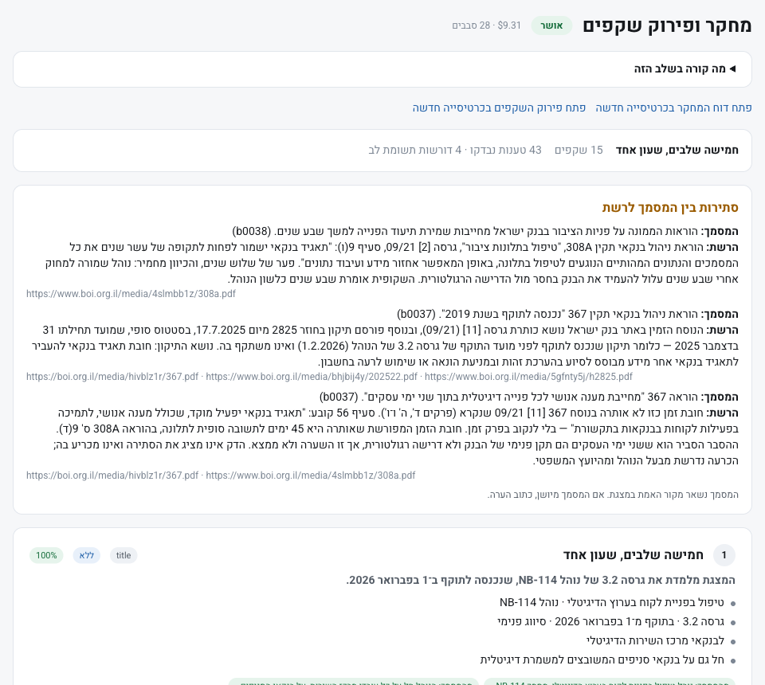
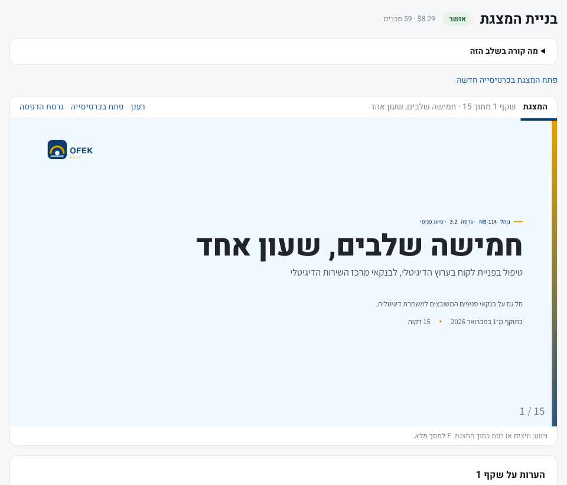

<div align="center">



<br>


<h3 dir="rtl">מעלים מסמך. מאשרים חמישה שלבים. מקבלים מצגת הדרכה.</h3>

<p dir="rtl">
<a href="#התקנה">התקנה</a> ·
<a href="#איך-זה-עובד">איך זה עובד</a> ·
<a href="#כמה-זה-עולה-וכמה-זמן">עלויות</a> ·
<a href="#כשמשהו-לא-עובד">פתרון בעיות</a> ·
<a href="docs/DEVELOPMENT.md">למפתחים</a>
</p>



</div>

<div dir="rtl">

## מה זה

Deck Studio הופך מסמך ארגוני אחד, PDF, Word או PowerPoint, למצגת הדרכה ממותגת בעברית.
צוות סוכני Claude מחלץ את השפה העיצובית מהמסמך, בונה מטרות למידה, בודק כל עובדה מול המקור, כותב את השקפים ומבקר אותם בדפדפן.
**אתם נשארים בשליטה:** כל שלב נעצר, מציג לכם את התוצר, וממשיך רק אחרי אישור.

<table>
<tr>
<td width="50%" valign="top">

### 🎨 נאמן למותג
הלוגו, הצבעים והגופנים נלקחים מהמסמך עצמו. אפשר לתקן כל אחד מהם בלחיצה לפני שממשיכים.

</td>
<td width="50%" valign="top">

### 🎯 בנוי סביב למידה
מטרות למידה ברורות, מסר אחד לכל שקף, שאלות בדיקת ידע והערות למציג.

</td>
</tr>
<tr>
<td width="50%" valign="top">

### 🔎 כל עובדה עם מקור
כל טענה נבדקת מול המסמך. סתירות בין המסמך לרשת מוצגות לכם, והסוכנים לא מכריעים בהן לבד.

</td>
<td width="50%" valign="top">

### ✅ בקרת איכות אמיתית
כל שקף מצולם בדפדפן. שופט מחפש גלישות, צבעים מחוץ למותג ובעיות כיוון, וסוכן מתקן.

</td>
</tr>
</table>

## איך זה עובד

</div>



<div dir="rtl">

| | שלב | מה הסוכנים עושים | מה אתם עושים בשער |
|:-:|---|---|---|
| 1 | **שפה עיצובית** | מחלצים לוגו, צבעים וגופנים מהמסמך | משנים צבע, גופן או לוגו ישירות |
| 2 | **מתווה** | כותבים מטרות למידה ומחלקים לפרקים, כל עובדה עם הפניה לעמוד | מאשרים, או מעירים על פרק |
| 3 | **מחקר ופירוק** | בודקים כל טענה מול המסמך, מוסיפים הקשר מהרשת, מסר אחד לשקף | מאשרים, או מעירים על שקף |
| 4 | **בניית המצגת** | כותבים את השקפים מתוך השפה העיצובית בלבד | מדפדפים ומעירים על השקף שמוצג |
| 5 | **בקרת איכות** | מצלמים כל שקף, שופט מדרג בעיות, ומתקנים | אישור סופי |

**"אשר והמשך"** מפעיל את השלב הבא. הערה ואז **"שלח לתיקון"** מריצים סבב תיקון על השלב הנוכחי בלבד.

<table>
<tr>
<td width="50%" align="center"><br><sub>שער המחקר: כל שקף עם העובדות שלו ומקורן</sub></td>
<td width="50%" align="center"><br><sub>שער המצגת: מדפדפים ומעירים על השקף שמוצג</sub></td>
</tr>
</table>

## התקנה

**מה צריך לפני שמתחילים**

- 💻 **Mac או Linux.** ב־Windows עובדים דרך WSL.
- 🟩 **Node.js 22 ומעלה**, מ־[nodejs.org](https://nodejs.org). ב־Mac אפשר גם `brew install node@22`.
- 🔑 **חיבור ל־Claude**, אחת משתי האפשרויות:
  - **מפתח API** מ־[console.anthropic.com](https://console.anthropic.com). משלמים לפי שימוש, ומתאים לצוותים.
  - **מנוי Claude Pro או Max**, דרך [Claude Code](https://claude.com/claude-code) שמחובר במחשב.

**שלוש פקודות**

</div>

```bash
git clone https://github.com/booya1986/deck-studio.git
cd deck-studio
./setup.sh
```

<div dir="rtl">

`setup.sh` מתקין את התלויות ומפעיל אשף קצר שעושה את כל השאר:

| | האשף בודק | ואם חסר |
|:-:|---|---|
| 1 | גרסת Node | מסביר מאיפה להוריד |
| 2 | כלי PDF (poppler) | מציע להתקין ב־Mac, ונותן פקודה ב־Linux |
| 3 | דפדפן לבדיקת המצגות | מוריד אותו, פעם אחת, כ־100MB |
| 4 | חיבור ל־Claude | מדביקים מפתח API או בוחרים מנוי, ובודקים בבקשה זעירה |
| 5 | פורט פנוי | בוחר לבד את הבא בתור |

> [!NOTE]
> מפתח ה־API נשמר רק אצלכם, בקובץ `.env.local` שקריא רק לכם, ו־git מתעלם ממנו. אין בריפו הזה שום מפתח.

**בפעם הבאה** מספיק:

</div>

```bash
pnpm studio
```

<div dir="rtl">

## כמה זה עולה וכמה זמן

| | מצגת של 15 שקפים ממסמך של כ־10 עמודים |
|---|---|
| ⏱️ **זמן** | כשעה מתחילתה ועד סופה, רובה בבנייה ובבקרת האיכות |
| 💳 **עם מפתח API** | בערך 15 עד 35 דולר למצגת |
| 🎟️ **עם מנוי** | נספר ממכסת השימוש. אם המכסה נגמרת באמצע, השלב נעצר, ואפשר להריץ אותו שוב אחרי האיפוס |

## פרטיות

- 🗂️ המסמכים והמצגות נשמרים רק במחשב שלכם, בתיקייה `data/projects`, ולא עולים ל־git.
- ☁️ תוכן המסמך נשלח ל־Claude לעיבוד.
- 🌐 בשלב המחקר הסוכן מחפש ברשת לפי נושאי המסמך.

## כשמשהו לא עובד

</div>

```bash
pnpm checkup          # בודק הכל בלי לשאול שאלות
pnpm checkup --test   # וגם שולח בקשת בדיקה זעירה ל-Claude
pnpm wizard           # מריץ את האשף שוב ומתקן
```

<div dir="rtl">

<details>
<summary><b>"Deck Studio לא מחובר ל־Claude, או שהמפתח לא תקין"</b></summary>
<br>
מריצים <code>pnpm wizard</code>, בוחרים מחדש מפתח API או מנוי, ומריצים את השלב שוב.
</details>

<details>
<summary><b>"נגמרה מכסת השימוש של Claude"</b></summary>
<br>
ההודעה אומרת מתי המכסה מתאפסת. אפשר לחכות ולהריץ את השלב שוב, או להוסיף מפתח API דרך <code>pnpm wizard</code> ולהמשיך מיד.
</details>

<details>
<summary><b>החילוץ מ־PDF נכשל</b></summary>
<br>
חסרים כלי ה־PDF. ב־Mac: <code>brew install poppler</code>. ב־Linux: <code>sudo apt-get install -y poppler-utils</code>.
</details>

<details>
<summary><b>בקרת האיכות נכשלת מיד</b></summary>
<br>
הדפדפן לבדיקה לא הותקן. מריצים <code>pnpm exec playwright install chromium</code>.
</details>

<details>
<summary><b>הפורט תפוס</b></summary>
<br>
<code>pnpm studio</code> בוחר לבד את הפורט הפנוי הבא ומדפיס את הכתובת.
</details>

## למפתחים

מבנה הקוד, הפקודות, מדידות זמן ועלות והחלטות תכנון נמצאים ב־[docs/DEVELOPMENT.md](docs/DEVELOPMENT.md).

</div>
